# PTCHz Folio

[](https://github.com/Alizrr/ptchz-folio/actions/workflows/ci.yml)
[](LICENSE)
[](frontend/package.json)
[](backend/requirements.txt)

PTCHz Folio is a self-hostable bilingual portfolio and resume platform built with React and FastAPI. It provides a public portfolio, printable resume page, RTL Persian support, and an authenticated admin dashboard for managing content without editing code.

## معرفی فارسی

PTCHz Folio یک پلتفرم متن‌باز برای ساخت نمونه‌کار و رزومه دو‌زبانه است. این پروژه با پشتیبانی از زبان فارسی، چیدمان راست‌به‌چپ، صفحه رزومه قابل چاپ و پنل مدیریت، امکان ویرایش بخش‌هایی مثل پروفایل، تجربه‌ها، پروژه‌ها، مهارت‌ها، مقالات، جوایز و راه‌های ارتباطی را بدون نیاز به تغییر مستقیم کد فراهم می‌کند.

## Screenshots

> [!IMPORTANT]
>
> The content shown in the screenshots is demonstration data generated from the project's seed dataset and AI-generated sample content.
>
> Names, publications, awards, work experience, skills, statistics, and other profile information shown in the screenshots are provided solely to demonstrate the platform's features and bilingual English/Persian capabilities.
>
> Unless explicitly stated otherwise, the showcased information should not be interpreted as real personal, academic, or professional data belonging to Ali Zareei or any other individual.

> [!IMPORTANT]
>
> اطلاعات نمایش داده‌شده در اسکرین‌شات‌های این پروژه صرفاً داده‌های نمونه (Seed Data) و محتوای تولیدشده برای نمایش قابلیت‌های سامانه هستند.
>
> نام‌ها، مقالات، سوابق کاری، جوایز، مهارت‌ها، آمارها و سایر اطلاعات موجود در تصاویر تنها برای نمایش امکانات پروژه و پشتیبانی دو‌زبانه فارسی و انگلیسی استفاده شده‌اند.
>
> مگر در مواردی که صراحتاً ذکر شده باشد، هیچ‌یک از این اطلاعات نباید به‌عنوان اطلاعات واقعی شخصی، دانشگاهی یا حرفه‌ای متعلق به علی زارعی یا شخص دیگری تلقی شوند.

### English Version

#### Public Portfolio

| Home                                            | Publications                                                    |
| ----------------------------------------------- | --------------------------------------------------------------- |
| 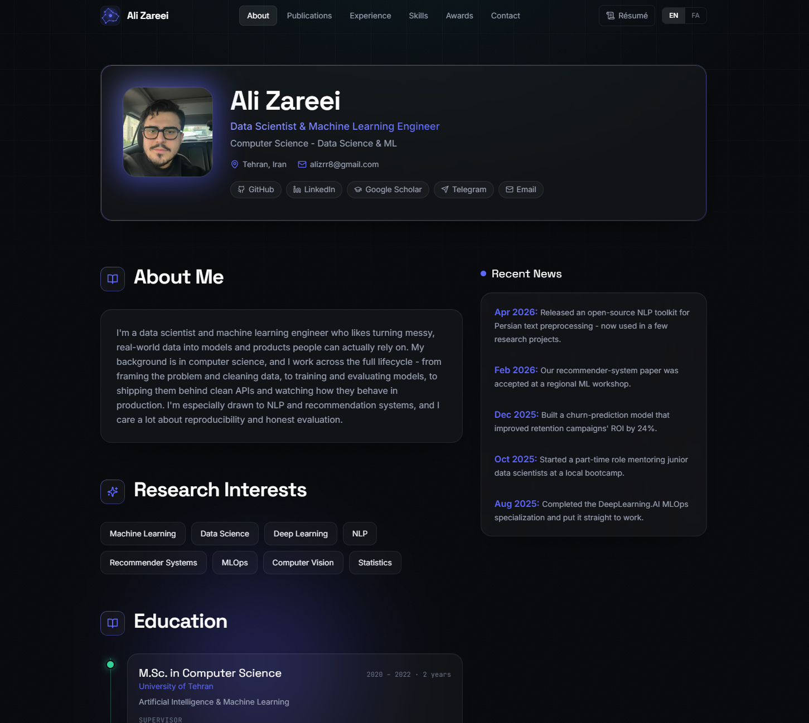 | 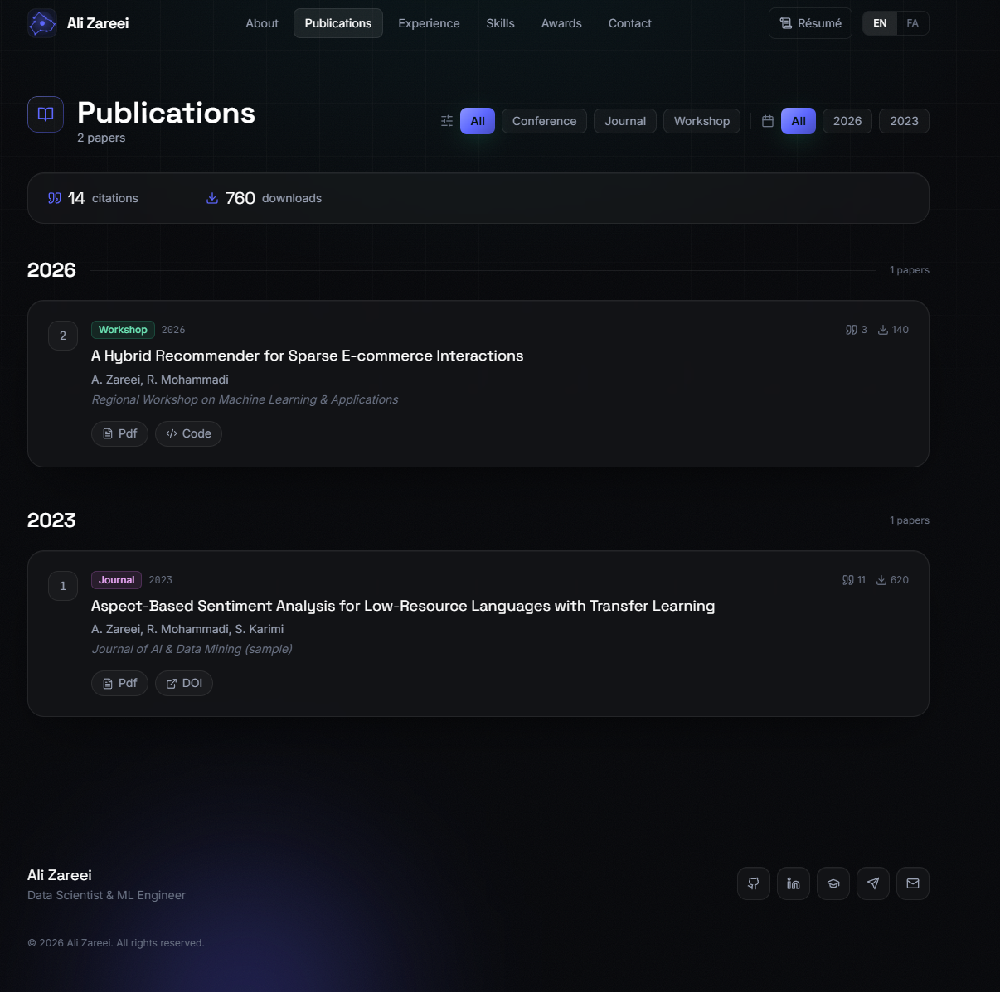 |

| Contact                                               |
| ----------------------------------------------------- |
| 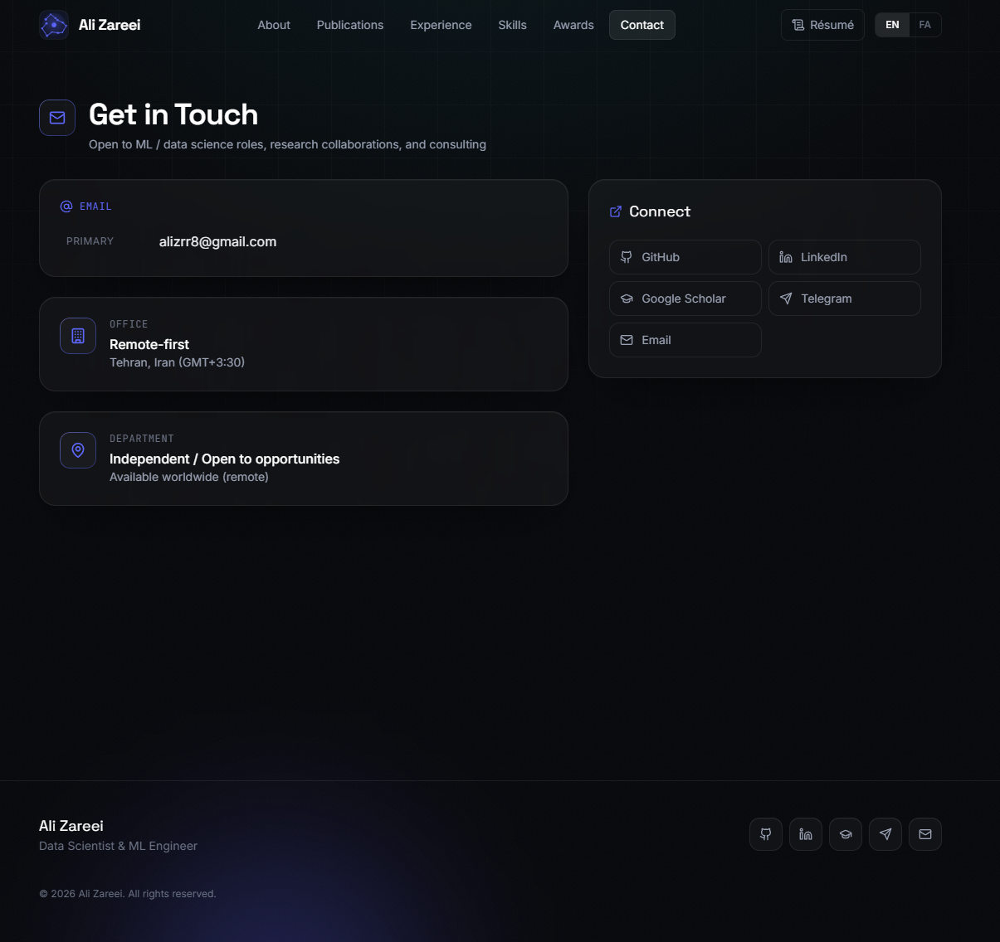 |

#### Admin Dashboard

| Dashboard                                                        | Customization                                                              |
| ---------------------------------------------------------------- | -------------------------------------------------------------------------- |
| 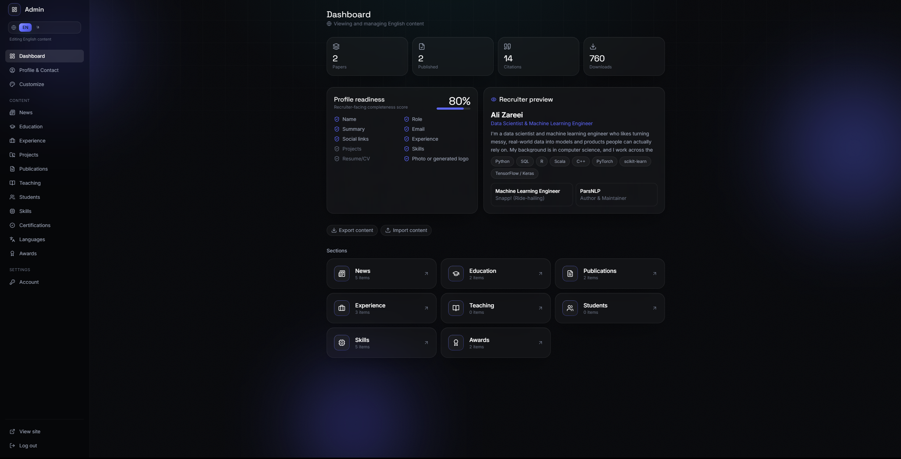 | 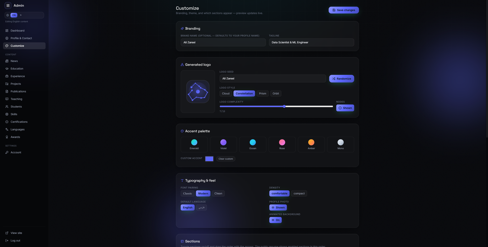 |

### Persian Version

#### Public Portfolio / RTL Layout

| Home / About                                                 | Publications                                                       |
| ------------------------------------------------------------ | ------------------------------------------------------------------ |
| 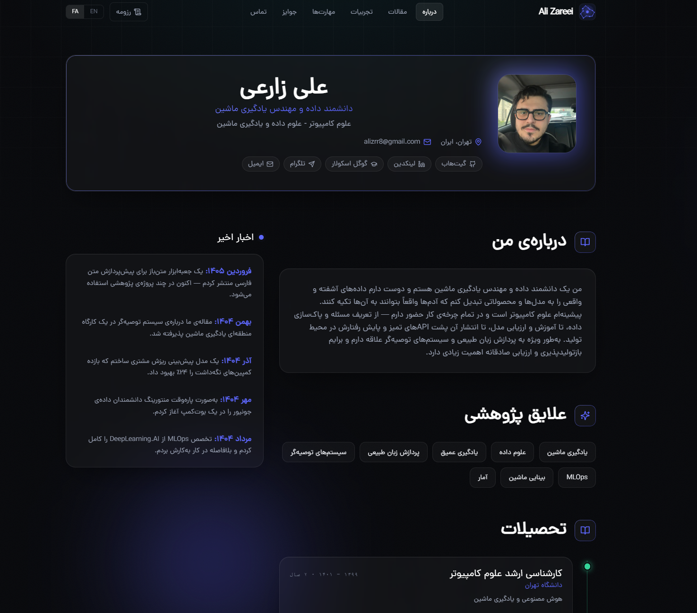 | 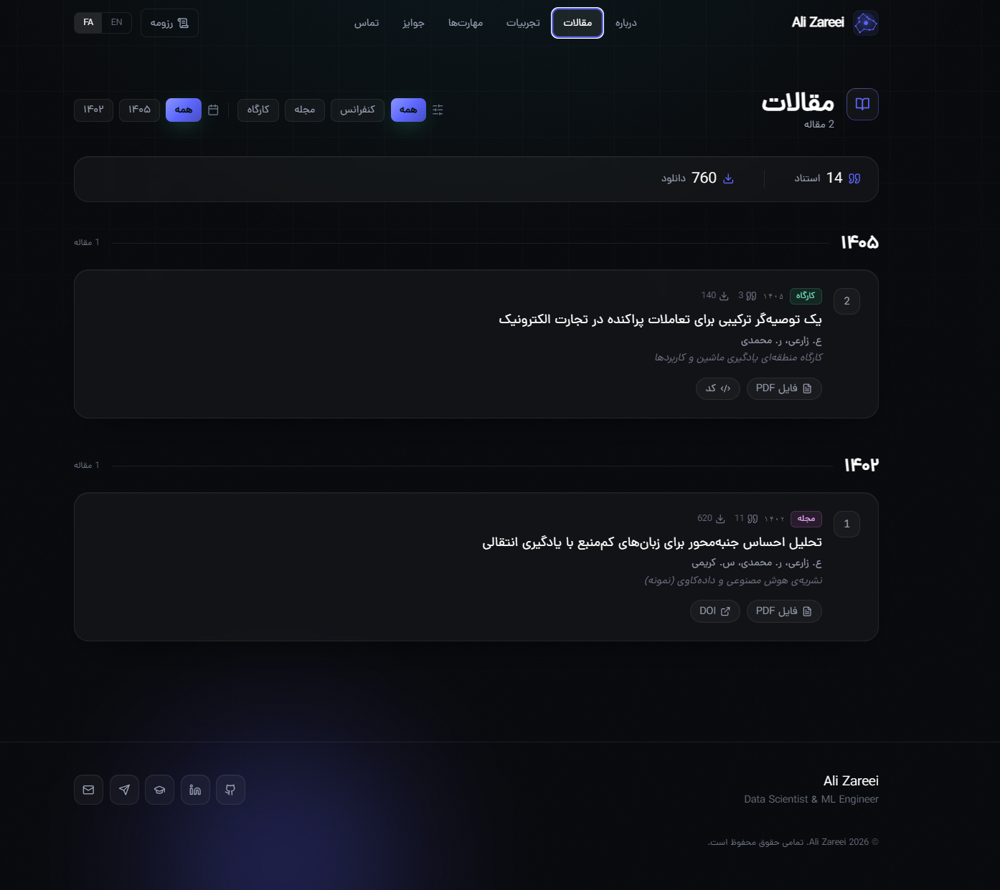 |

| Experience                                                     | Skills                                                 |
| -------------------------------------------------------------- | ------------------------------------------------------ |
| 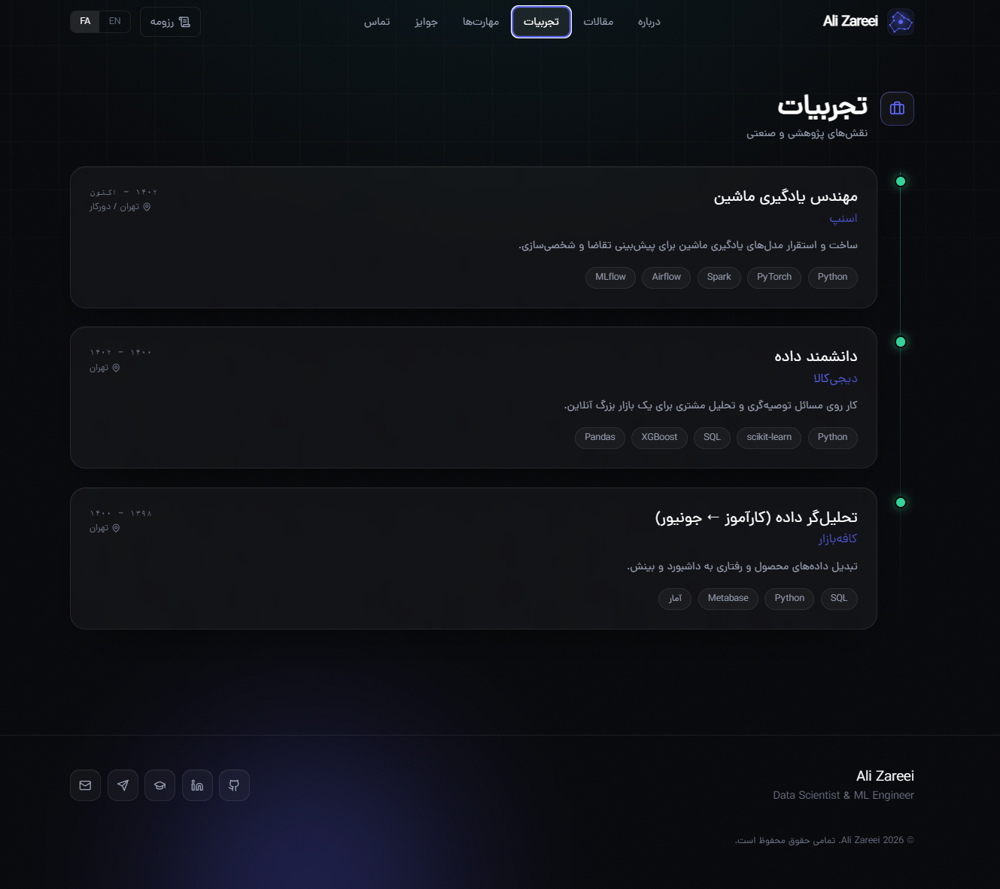 | 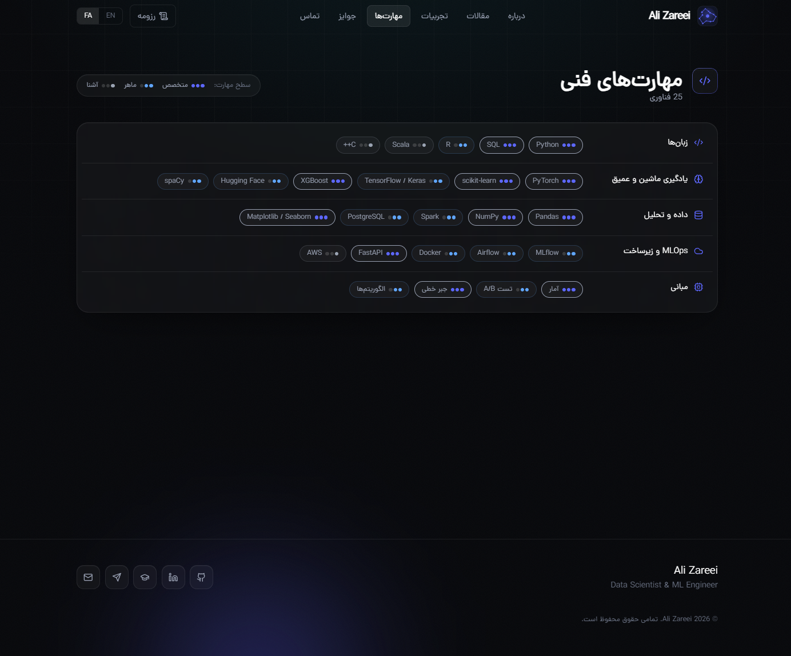 |

| Awards                                                 | Contact                                                  |
| ------------------------------------------------------ | -------------------------------------------------------- |
| 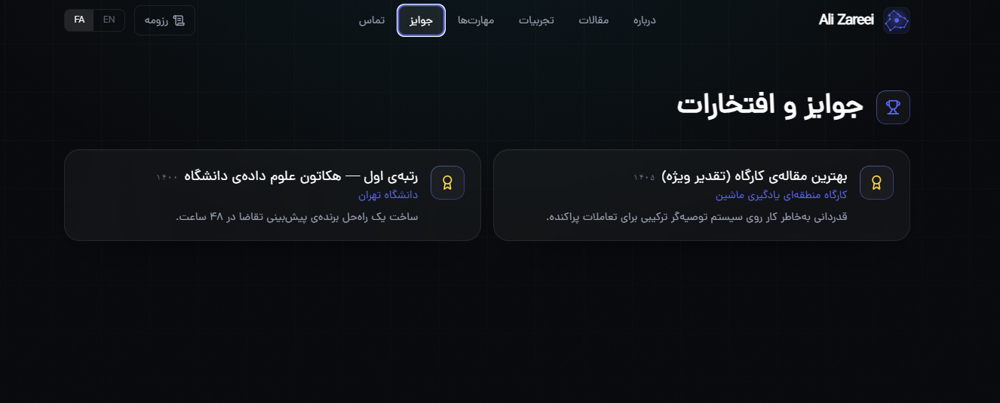 | 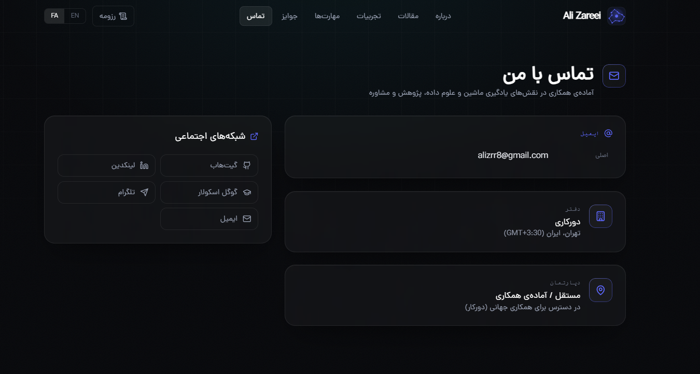 |

## Features

* Bilingual portfolio with English and Persian support
* RTL-aware Persian layout
* Public pages for profile, experience, projects, publications, skills, awards, contact, and resume
* Printable resume page
* Authenticated admin dashboard for content management
* Live recruiter preview inside the admin panel
* Theme customization with accent colors, typography, density, section visibility, and generated logo controls
* Content import/export for portable backups
* Image support for profile and portfolio content
* SQLite by default, with PostgreSQL-compatible architecture through SQLAlchemy
* GitHub Actions CI for frontend and backend checks

## Tech Stack

### Frontend

* React
* Vite
* Tailwind CSS
* Framer Motion
* Lucide Icons

### Backend

* FastAPI
* SQLAlchemy
* SQLite
* Pydantic
* JWT-based authentication

### Tooling

* GitHub Actions
* ESLint
* npm
* Python virtual environments

## Project Structure

```text
ptchz-folio/
├── backend/
│   ├── main.py
│   ├── requirements.txt
│   └── portfolio.db
├── frontend/
│   ├── src/
│   ├── package.json
│   └── vite.config.js
├── docs/
│   ├── assets/
│   │   └── telegram-qr.png
│   └── screenshots/
│       ├── home.png
│       ├── publications.png
│       ├── contact.png
│       ├── admin-dashboard.png
│       ├── admin-customize.png
│       ├── home-fa.png
│       ├── publications-fa.png
│       ├── experience-fa.png
│       ├── skills-fa.png
│       ├── awards-fa.png
│       └── contact-fa.png
├── .env.example
├── CONTRIBUTING.md
├── LICENSE
└── README.md
```

## Quick Start

### 1. Clone the repository

```bash
git clone https://github.com/Alizrr/ptchz-folio.git
cd ptchz-folio
```

### 2. Backend setup

```bash
cd backend
python -m venv .venv
```

On Windows:

```bash
.venv\Scripts\activate
```

On macOS/Linux:

```bash
source .venv/bin/activate
```

Install dependencies:

```bash
pip install -r requirements.txt
```

Run the backend:

```bash
uvicorn main:app --reload --host 127.0.0.1 --port 8000
```

The backend API docs will usually be available at:

```text
http://localhost:8000/docs
```

### 3. Frontend setup

Open a new terminal:

```bash
cd frontend
npm install
npm run dev
```

The frontend will usually be available at:

```text
http://localhost:5173
```

## Environment Variables

Copy the example environment file before running the project locally:

```bash
cp .env.example backend/.env
```

On Windows PowerShell:

```powershell
Copy-Item .env.example backend/.env
```

Then update the values inside `backend/.env`, especially:

```env
SECRET_KEY=replace-with-a-long-random-secret
ADMIN_USERNAME=change-me
ADMIN_PASSWORD=change-me-before-first-run
```

Generate a secure secret key with:

```bash
python -c "import secrets; print(secrets.token_hex(32))"
```

## Seed Sample Data

The project can be populated with optional bilingual sample data for local previews and screenshots.

```bash
cd backend
python seed.py
```

Seed data is useful for testing and demonstration only. Review and replace all sample content before using the project as a real personal portfolio.

## Admin Panel

The admin panel allows authenticated users to manage portfolio content without directly editing source files.

Main admin features include:

* Profile and contact management
* News, education, experience, project, publication, skill, certification, language, and award sections
* Resume-facing content preview
* Theme and branding customization
* Generated logo controls
* Import/export content tools
* Section visibility and ordering controls

## Template Use

This repository is designed as a reusable portfolio and resume platform. Replace the sample profile data, images, social links, and resume content before publishing your own version.

If you fork this project, make sure to update:

* Profile photo
* Name and role
* Contact information
* Social links
* Publications
* Experience
* Projects
* Resume content
* Admin credentials
* Screenshots

## Security Notes

* Never commit real `.env` files or production secrets.
* Change the default admin credentials before deployment.
* Generate a strong `SECRET_KEY`.
* Review CORS settings and use HTTPS in production.
* Keep private databases and uploaded assets out of version control.

## Roadmap

* Add Docker and Docker Compose support
* Add production deployment guide
* Add database migration support
* Add public demo deployment
* Improve accessibility and responsive layout checks
* Add more portfolio layout presets
* Add richer resume export options

## Support / Donation

If you find this project useful and would like to support its development, I would truly appreciate it. Your support helps me continue improving PTCHz Folio, add new features, maintain the codebase, and make the project more useful for developers, students, and researchers.

For donation or support inquiries, feel free to contact me on Telegram:

**Telegram:** [@Z4r3i](https://t.me/Z4r3i)

<p align="center">
  <a href="https://t.me/Z4r3i">
    
  </a>
</p>

### حمایت مالی / دونیت

اگر این پروژه برای شما مفید بوده و دوست دارید از توسعه آن حمایت کنید، واقعاً خوشحال می‌شوم. حمایت شما باعث می‌شود بتوانم PTCHz Folio را بهتر نگهداری کنم، قابلیت‌های جدید به آن اضافه کنم و پروژه را برای توسعه‌دهنده‌ها، دانشجوها و پژوهشگرها کاربردی‌تر گسترش بدهم.

برای هماهنگی دونیت یا حمایت از پروژه، می‌توانید از طریق تلگرام پیام بدهید:

**Telegram:** [@Z4r3i](https://t.me/Z4r3i)

## Contributing

Contributions are welcome. Please read [CONTRIBUTING.md](CONTRIBUTING.md) before opening a pull request.

Recommended workflow:

1. Fork the repository
2. Create a feature branch
3. Make your changes
4. Run frontend and backend checks
5. Open a pull request with a clear description

## License

This project is licensed under the MIT License. See [LICENSE](LICENSE) for details.

## Author

**Ali Zareei**

* GitHub: [@Alizrr](https://github.com/Alizrr)
* Telegram: [@Z4r3i](https://t.me/Z4r3i)
* Email: [alizrr8@gmail.com](mailto:alizrr8@gmail.com)
